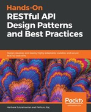
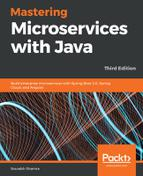
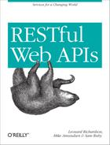
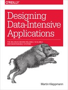
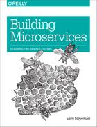
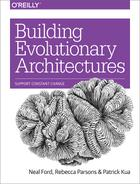

# SCJ - Tecnologia Webservices e RESTful 

## Aulas:

* [Introdução e boas práticas de design de serviços](./aula-1.md)
* [Serviços RESTful](./aula-2.md)
* [Tratamento de erros](./aula-3.md)
* [Monitoramento e segurança de serviços](./aula-4.md)

## Referências:

Abaixo segue a lista de livros, vídeos e materiais de referência utilizados como apoio para esta disciplina.

| Capa | Título | ISBN | Autor(es) |
|:-:|--------|------|-----------|
||[RESTful Java Web Services, Third Edition](https://www.amazon.com/RESTful-Java-Web-Services-pragmatic/dp/1788294041/ref=sr_1_1?keywords=9781788294041&qid=1566425192&s=books&sr=1-1)|9781788294041|Bogunuva Mohanram Balachandar|
||[Hands-On RESTful API Design Patterns and Best Practices](https://www.amazon.com/Hands-RESTful-Design-Patterns-Practices/dp/1788992660/ref=sr_1_1?keywords=9781788992664&qid=1566425304&s=books&sr=1-1)|9781788992664|Pethuru Raj, Harihara Subramanian|
||[Mastering Microservices with Java, Third Edition](https://www.amazon.com/Mastering-Microservices-Java-enterprise-microservices/dp/1789530725/ref=sr_1_1?keywords=9781789530728&qid=1566425382&s=books&sr=1-1)|9781789530728|Sourabh Sharma|
||[RESTful Java with JAX-RS 2.0, 2nd Edition](https://www.amazon.com/RESTful-Java-JAX-RS-2-0-Distributed/dp/144936134X/ref=sr_1_1?keywords=9781449361341&qid=1566425439&s=books&sr=1-1)|9781449361341|Bill Burke|
||[RESTful Web APIs](https://www.amazon.com/RESTful-Web-APIs-Services-Changing/dp/1449358063/ref=sr_1_1?keywords=9781449358068&qid=1566425522&s=books&sr=1-1)|9781449358068|Leonard Richardson, Sam Ruby, Mike Amundsen|
||[Designing Data-Intensive Applications](https://www.amazon.com/Designing-Data-Intensive-Applications-Reliable-Maintainable/dp/1449373321/ref=sr_1_1?keywords=9781449373320&qid=1566425588&s=books&sr=1-1)|9781449373320|Martin Kleppmann|
||[Microservices Patterns](https://www.amazon.com/Microservices-Patterns-examples-Chris-Richardson/dp/1617294543/ref=sr_1_1?keywords=9781617294549&qid=1566425641&s=books&sr=1-1)|9781617294549|Chris Richardson|
||[Building Microservices](https://www.amazon.com/Building-Microservices-Designing-Fine-Grained-Systems/dp/1491950358/ref=sr_1_1?keywords=9781491950357&qid=1566425716&s=books&sr=1-1)|9781491950357|Sam Newman|
||[Building Evolutionary Architectures](https://www.amazon.com/Building-Evolutionary-Architectures-Support-Constant/dp/1491986360/ref=sr_1_1?keywords=9781491986363&qid=1566425782&s=books&sr=1-1)|9781491986363|Patrick Kua, Rebecca Parsons, Neal Ford| 
